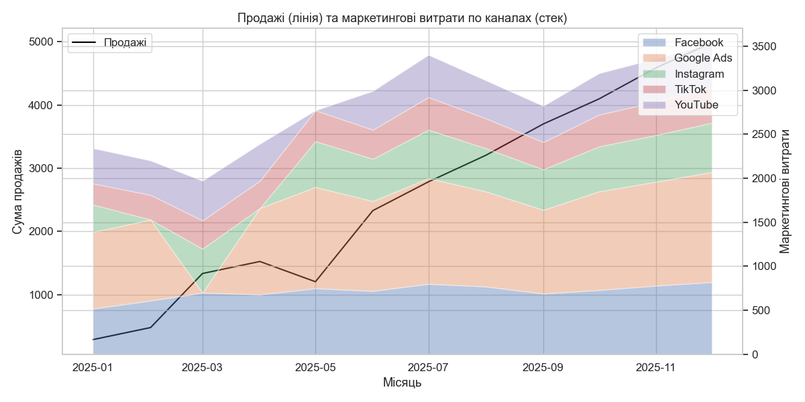

### Алгоритм виконання

1. Завантажили маркетингові дані з Google Sheets у Python (через експортування у CSV-файл).

2. Очистили маркетингові дані.

- Привели колонку з датами до правильного формату, щоб можна було працювати з даними по місяцях.
- Очистили назви маркетингових каналів від зайвих пробілів та некоректного формату.
- Стандартизували назви маркетингових каналів. Це дозволило уникнути дублювання одного й того ж каналу під різними назвами.
- Очистили дані по витратам (перевірили та заповнили порожні значення, де текстові значення замість чисел та некоректні значення типу NA, null, missing. Окремо перевірили наявність від’ємних витрат і виключили їх з розрахунків - створивши окремий стовпчик)
- Привели всі дати до одного стандарту — початок відповідного місяця. Це дозволило коректно об’єднувати маркетингові дані з продажами.

3. Завантажили дані про замовлення.

- Підключилися до бази даних PostgreSQL.
- Завантажили таблицю з замовленнями.

4. Агрегували продажі по місяцях (Порахували кількість замовлень та загальну суму продажів за кожен місяць).

5. Об’єднали продажі та маркетингові витрати згрупувавши маркетингові витрати по місяця та об’єднавши їх з даними про продажі за місяцем.

6. Для кожного місяця розрахували показник ROI.
Переконалися, що розрахунок коректний (без ділення на нуль).

7. Визначили топ-3 клієнтів які зробили найдорожчі замовлення

  customer_id  orders_count  total_spent
59          160             1       2200.0
56          157             1       2100.0
53          154             1       2000.0

8. графік

6. Зробити висновок: який канал найбільш ефективний?